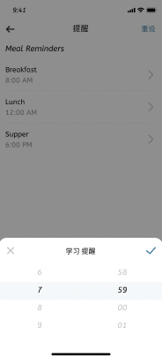

# 提醒功能

[TOC]

## 需求背景

> 用户通常会忘记记录学习、运动、工作、娱乐这些动作，并且给予通知入口让用户自定义提醒时间，发送推送告诉用户要开始提醒这些动作。

不同用户个人学习与运动的时间节点不同，所以会根据用户类型给予不同的推送提醒时间告诉用户要开始学习或者运动。

## 数据预测和数据逻辑
打开提醒功能用户对次留有正向影响

## 需求描述
- **区分用户群体** : 在职群体与学生群体的学习时间不同，如果用户没有选择是在职或者在校会出现弹窗提醒用户选择。
- **给予默认提醒时间 ** :在职群体一般下班时间在6点之后，通勤+吃饭调整之类的在1-2小时。所以学习时间我们默认晚上8点。学生群体早上8-12，14-18，19-21都可能为休息时间，这块@Yurk想想
- **入口**:入口设定两处:一处在首页board上，还有一处在me界面。两处作用不同：1.首页只设定学习提醒时间 2.me界面设定整体提醒时间
	
## 视觉
[figma](https://www.figma.com/file/fRxzwSAEQIEQghklX4Rw4H/Datawhale%E5%AD%A6%E4%B9%A0App?node-id=0%3A1)
## 埋点
候补
## 字符串
候补